<div align="center">

# 🚀 InitStack FastAPI

### **Production-Ready FastAPI Microservices Platform with Enterprise-Grade Infrastructure**

<!-- Project Status -->
[](https://github.com/DataRohit/InitStack)
[](./license)
[](#)

<!-- Core Technologies -->
[](https://www.python.org/downloads/release/python-3140/)
[](https://fastapi.tiangolo.com/)
[](https://www.uvicorn.org/)
[](https://docs.pydantic.dev/)
[](https://www.sqlalchemy.org/)
[](https://alembic.sqlalchemy.org/)

<!-- Task Processing -->
[](https://docs.celeryq.dev/)
[](https://flower.readthedocs.io/)
[](https://www.rabbitmq.com/)

<!-- Data Storage -->
[](https://www.postgresql.org/)
[](https://redis.io/)
[](https://www.elastic.co/)
[](https://min.io/)

<!-- Service Discovery & Load Balancing -->
[](https://www.consul.io/)
[](http://www.haproxy.org/)

<!-- Observability & Monitoring -->
[](https://www.elastic.co/apm)
[](https://www.elastic.co/kibana)
[](https://prometheus.io/)
[](https://opentelemetry.io/)
[](https://www.elastic.co/beats/filebeat)
[](https://www.elastic.co/beats/metricbeat)
[](https://www.elastic.co/beats/heartbeat)

<!-- Security & Authentication -->
[](https://github.com/P-H-C/phc-winner-argon2)
[](https://pyjwt.readthedocs.io/)
[](https://authlib.org/)
[](https://oauth.net/2/)

<!-- Development Tools -->
[](https://www.docker.com/)
[](https://github.com/astral-sh/ruff)
[](https://pytest.org/)
[](https://github.com/axllent/mailpit)

**A comprehensive, production-ready FastAPI application with complete microservices architecture, featuring advanced monitoring, distributed task processing, and enterprise-grade infrastructure.**

[Features](#-key-features) • [Architecture](#-architecture) • [Tech Stack](#-tech-stack) • [Services](#-infrastructure-services) • [API Documentation](#-api-endpoints)

</div>

---

## 📋 Overview

**InitStack FastAPI** is a battle-tested, enterprise-grade FastAPI application designed for modern microservices architectures. Built with scalability, observability, and developer experience in mind, it provides a complete foundation for building production-ready APIs with minimal configuration.

This platform integrates industry-standard tools and best practices, including distributed tracing, metrics collection, centralized logging, service discovery, and asynchronous task processing. Whether you're building a small API or a large-scale distributed system, InitStack provides the infrastructure you need.

## ✨ Key Features

### 🔐 **Authentication & Authorization**
- **JWT-based Authentication** with access and refresh tokens
- **OAuth 2.0 Integration** (Google & GitHub)
- **User Management** with signup, login, password reset flows
- **Account Management** with activation/deactivation workflows
- **Token Caching** with Redis for high-performance validation
- **Secure Password Hashing** using Argon2

### 🏗️ **Architecture & Infrastructure**
- **Microservices Architecture** with service discovery (Consul)
- **Load Balancing** with HAProxy for 3 FastAPI instances
- **Distributed Task Processing** with Celery (3 workers + 3 beat schedulers)
- **Message Queue** with RabbitMQ for reliable task distribution
- **Object Storage** with MinIO for file management
- **Database Migrations** with Alembic

### 📊 **Observability & Monitoring**
- **Distributed Tracing** with Elastic APM
- **Metrics Collection** with Prometheus & OpenTelemetry
- **Centralized Logging** with Elasticsearch & Filebeat
- **Log Visualization** with Kibana dashboards
- **Service Health Monitoring** with Heartbeat
- **Infrastructure Metrics** with Metricbeat (9 instances)
- **Prometheus Exporters** for Consul, Redis, PostgreSQL, Elasticsearch
- **Celery Monitoring** with Flower

### 🚀 **Performance & Scalability**
- **Connection Pooling** for PostgreSQL, Redis, and RabbitMQ
- **Rate Limiting** with Redis-backed middleware
- **CORS Configuration** with flexible origin management
- **Request Size Limits** for security
- **Async/Await** throughout the application
- **WebSocket Support** for real-time communication

### 🛠️ **Developer Experience**
- **Structured Logging** with JSON format
- **Comprehensive Error Handling** with detailed responses
- **OpenAPI Documentation** (Swagger & ReDoc)
- **Type Safety** with Pydantic v2
- **Code Quality** with Ruff linting
- **Testing Framework** with pytest and 100% coverage requirement
- **Hot Reload** for development
- **Environment-based Configuration** with validation

---

## 🏛️ Architecture

```mermaid
graph TB
    subgraph "Load Balancer"
        HAProxy[HAProxy :8000]
    end
    
    subgraph "FastAPI Services"
        API1[FastAPI-1 :8080]
        API2[FastAPI-2 :8080]
        API3[FastAPI-3 :8080]
    end
    
    subgraph "Task Processing"
        Worker1[Celery Worker 1]
        Worker2[Celery Worker 2]
        Worker3[Celery Worker 3]
        Beat1[Celery Beat 1]
        Beat2[Celery Beat 2]
        Beat3[Celery Beat 3]
        Flower[Flower :5555]
    end
    
    subgraph "Data Layer"
        PostgreSQL[(PostgreSQL :5432)]
        Redis[(Redis :6379)]
        RabbitMQ[RabbitMQ :5672]
        Elasticsearch[(Elasticsearch :9200)]
        MinIO[MinIO :9001]
    end
    
    subgraph "Service Discovery"
        Consul[Consul :8500]
    end
    
    subgraph "Monitoring Stack"
        Prometheus[Prometheus :9090]
        Kibana[Kibana :5601]
        APM[Elastic APM :8200]
        Filebeat[Filebeat]
        Heartbeat[Heartbeat]
        Metricbeat[Metricbeat x9]
    end
    
    HAProxy --> API1
    HAProxy --> API2
    HAProxy --> API3
    
    API1 --> PostgreSQL
    API2 --> PostgreSQL
    API3 --> PostgreSQL
    
    API1 --> Redis
    API2 --> Redis
    API3 --> Redis
    
    API1 --> RabbitMQ
    API2 --> RabbitMQ
    API3 --> RabbitMQ
    
    API1 --> Elasticsearch
    API2 --> Elasticsearch
    API3 --> Elasticsearch
    
    API1 --> MinIO
    API2 --> MinIO
    API3 --> MinIO
    
    API1 --> Consul
    API2 --> Consul
    API3 --> Consul
    
    Worker1 --> RabbitMQ
    Worker2 --> RabbitMQ
    Worker3 --> RabbitMQ
    
    Beat1 --> RabbitMQ
    Beat2 --> RabbitMQ
    Beat3 --> RabbitMQ
    
    Flower --> RabbitMQ
    
    Filebeat --> Elasticsearch
    APM --> Elasticsearch
    Metricbeat --> Elasticsearch
    Heartbeat --> Elasticsearch
    
    Kibana --> Elasticsearch
    Prometheus --> Metricbeat
```



## 🔧 Tech Stack

### **Core Framework**
| Technology | Version | Purpose |
|------------|---------|----------|
| Python | 3.14.2 | Programming Language |
| FastAPI | 0.127.0 | Web Framework |
| Uvicorn | 0.40.0 | ASGI Server |
| Pydantic | 2.12.5 | Data Validation |
| SQLAlchemy | 2.0.45 | ORM |
| Alembic | 1.17.2 | Database Migrations |

### **Data Storage**
| Technology | Version | Purpose |
|------------|---------|----------|
| PostgreSQL | 18.1 | Primary Database |
| Redis | 8.4.0 | Caching & Session Store |
| Elasticsearch | 8.19.8 | Search & Logging |
| MinIO | 2025-04-22 | Object Storage |

### **Message Queue & Task Processing**
| Technology | Version | Purpose |
|------------|---------|----------|
| RabbitMQ | 4.2.1 | Message Broker |
| Celery | 5.6.0 | Distributed Task Queue |
| Flower | 2.0.1 | Celery Monitoring |

### **Service Discovery & Load Balancing**
| Technology | Version | Purpose |
|------------|---------|----------|
| Consul | 1.15.4 | Service Discovery |
| HAProxy | 3.3.1 | Load Balancer |

### **Observability & Monitoring**
| Technology | Version | Purpose |
|------------|---------|----------|
| Elastic APM | 8.19.8 | Application Performance Monitoring |
| Kibana | 8.19.8 | Log Visualization |
| Filebeat | 8.19.8 | Log Shipping |
| Metricbeat | 8.19.8 | Metrics Collection |
| Heartbeat | 8.19.8 | Uptime Monitoring |
| Prometheus | 3.8.1 | Metrics Storage |
| OpenTelemetry | 1.39.1 | Distributed Tracing |

### **Security & Authentication**
| Technology | Version | Purpose |
|------------|---------|----------|
| Argon2 | 25.1.0 | Password Hashing |
| PyJWT | 2.10.1 | JWT Token Management |
| Authlib | 1.6.6 | OAuth 2.0 |
| Cryptography | 46.0.3 | Encryption |

### **Development Tools**
| Technology | Version | Purpose |
|------------|---------|----------|
| Ruff | 0.14.10 | Linting & Formatting |
| Pytest | 9.0.2 | Testing Framework |
| Coverage | 7.13.0 | Code Coverage |
| Watchfiles | 1.1.1 | Hot Reload |

---

## 📁 Project Structure

```
initstack/
├── alembic/                      # Database migration scripts
│   ├── env.py                   # Alembic environment configuration
│   └── script.py.mako           # Migration template
├── compose/                      # Docker service configurations
│   ├── apm/                     # Elastic APM configuration
│   ├── celery-beat/             # Celery Beat scheduler configs
│   ├── celery-flower/           # Flower monitoring configs
│   ├── celery-worker/           # Celery worker configs
│   ├── consul/                  # Consul service discovery
│   ├── elasticsearch/           # Elasticsearch configs
│   ├── filebeat/                # Log shipping configs
│   ├── haproxy/                 # Load balancer configs
│   ├── heartbeat/               # Uptime monitoring
│   ├── kibana/                  # Kibana dashboard configs
│   ├── mailpit/                 # Email testing service
│   ├── metricbeat/              # Metrics collection (9 instances)
│   ├── minio/                   # Object storage configs
│   ├── postgresql/              # Database configs
│   ├── prometheus/              # Metrics storage configs
│   ├── rabbitmq/                # Message broker configs
│   └── redis/                   # Cache configs
├── config/                       # Application configuration
│   ├── adapters/                # External service adapters
│   │   ├── consul.py           # Service discovery adapter
│   │   ├── elasticsearch.py    # Search engine adapter
│   │   ├── email.py            # SMTP adapter
│   │   ├── minio.py            # Object storage adapter
│   │   ├── otel_metrics.py     # OpenTelemetry metrics
│   │   ├── postgresql.py       # Database adapter
│   │   ├── rabbitmq.py         # Message queue adapter
│   │   ├── redis.py            # Cache adapter
│   │   └── telemetry.py        # APM instrumentation
│   ├── celery_app.py           # Celery application setup
│   ├── logger.py               # Structured logging configuration
│   ├── metrics.py              # Prometheus metrics
│   ├── middlewares.py          # Custom middleware (rate limiting, logging)
│   ├── routes.py               # API route registration
│   ├── server.py               # FastAPI application factory
│   └── settings.py             # Environment-based settings
├── src/                          # Application source code
│   ├── controllers/             # API endpoint controllers
│   │   ├── auth/               # Authentication endpoints
│   │   │   ├── activate.py     # Account activation
│   │   │   ├── deactivate.py   # Account deactivation
│   │   │   ├── forgot_password.py
│   │   │   ├── login.py        # User login
│   │   │   ├── logout.py       # User logout
│   │   │   ├── me.py           # Current user info
│   │   │   ├── oauth_github.py # GitHub OAuth
│   │   │   ├── oauth_google.py # Google OAuth
│   │   │   ├── reactivate.py   # Account reactivation
│   │   │   ├── relogin.py      # Token refresh
│   │   │   ├── reset_password.py
│   │   │   └── signup.py       # User registration
│   │   ├── websocket/          # WebSocket endpoints
│   │   ├── consul.py           # Consul health checks
│   │   ├── elasticsearch.py    # Search endpoints
│   │   ├── health.py           # Health check endpoints
│   │   ├── rabbitmq.py         # Message queue endpoints
│   │   ├── rate_limit.py       # Rate limit info
│   │   ├── redis.py            # Cache endpoints
│   │   └── telemetry_controller.py # Metrics endpoints
│   ├── models/                  # SQLAlchemy ORM models
│   │   ├── base.py             # Base model class
│   │   └── users.py            # User model
│   ├── schemas/                 # Pydantic schemas
│   │   ├── auth/               # Authentication schemas
│   │   ├── base.py             # Base schemas
│   │   ├── consul.py           # Service discovery schemas
│   │   ├── elasticsearch.py    # Search schemas
│   │   ├── health.py           # Health check schemas
│   │   ├── rabbitmq.py         # Message queue schemas
│   │   ├── rate_limit.py       # Rate limit schemas
│   │   ├── redis.py            # Cache schemas
│   │   ├── telemetry.py        # Metrics schemas
│   │   └── websocket.py        # WebSocket schemas
│   ├── tasks/                   # Celery tasks
│   │   ├── auth/               # Authentication tasks
│   │   ├── health.py           # Health check tasks
│   │   └── maintenance.py      # Maintenance tasks
│   └── utils/                   # Utility functions
├── .envs/                        # Environment files per service
├── alembic.ini                  # Alembic configuration
├── docker-compose.yml           # Docker orchestration (30+ services)
├── dockerfile                   # Application container image
├── main.py                      # Application entry point
├── Makefile                     # Database migration commands
├── pyproject.toml              # Ruff configuration
├── pytest.ini                   # Test configuration
├── requirements.txt             # Python dependencies (176 packages)
└── readme.md                    # This file
```

---

## 🏢 Infrastructure Services

### **Core Application Services**

| Service | Container | Port(s) | Description |
|---------|-----------|---------|-------------|
| **HAProxy** | `initstack-haproxy-service` | `8000`, `8404` | Load balancer distributing traffic across 3 FastAPI instances |
| **FastAPI** | `initstack-fastapi-service-1/2/3` | `8080` (internal) | Main API application (3 replicas) |

### **Data Storage Services**

| Service | Container | Port(s) | Description |
|---------|-----------|---------|-------------|
| **PostgreSQL** | `initstack-postgresql-service` | `5432` | Primary relational database |
| **Redis** | `initstack-redis-service` | `6379` | Caching, session storage, and token cache |
| **Elasticsearch** | `initstack-elasticsearch-service` | `9200`, `9300` | Search engine and log storage |
| **MinIO** | `initstack-minio-service` | `9001` | S3-compatible object storage |

### **Message Queue & Task Processing**

| Service | Container | Port(s) | Description |
|---------|-----------|---------|-------------|
| **RabbitMQ** | `initstack-rabbitmq-service` | `5672`, `15672`, `15692` | Message broker for Celery tasks |
| **Celery Workers** | `initstack-celery-worker-1/2/3` | - | Distributed task workers (3 replicas) |
| **Celery Beat** | `initstack-celery-beat-1/2/3` | - | Task schedulers (3 replicas) |
| **Flower** | `initstack-celery-flower-service` | `5555` | Celery monitoring dashboard |

### **Service Discovery**

| Service | Container | Port(s) | Description |
|---------|-----------|---------|-------------|
| **Consul** | `initstack-consul-service` | `8500`, `8600`, `8301`, `8302`, `8300`, `8502` | Service registry and health checking |

### **Observability Stack**

#### **Monitoring & Metrics**
| Service | Container | Port(s) | Description |
|---------|-----------|---------|-------------|
| **Prometheus** | `initstack-prometheus-service` | `9090` | Time-series metrics database |
| **Consul Exporter** | `initstack-consul-exporter-service` | `9107` | Consul metrics exporter |
| **Redis Exporter** | `initstack-redis-exporter-service` | `9121` | Redis metrics exporter |
| **PostgreSQL Exporter** | `initstack-postgresql-exporter-service` | `9187` | PostgreSQL metrics exporter |
| **Elasticsearch Exporter** | `initstack-elasticsearch-exporter-service` | `9114` | Elasticsearch metrics exporter |

#### **Logging & Tracing**
| Service | Container | Port(s) | Description |
|---------|-----------|---------|-------------|
| **Kibana** | `initstack-kibana-service` | `5601` | Log visualization and analysis |
| **Elastic APM** | `initstack-apm-service` | `8200`, `5068` | Application performance monitoring |
| **Filebeat** | `initstack-filebeat-service` | `5066` | Log shipping to Elasticsearch |
| **Heartbeat** | `initstack-heartbeat-service` | `5065` | Uptime and availability monitoring |

#### **Metricbeat Instances (9 Total)**
| Service | Container | Port | Monitors |
|---------|-----------|------|----------|
| **Consul Metricbeat** | `initstack-consul-metricbeat-service` | `5067` | Consul service metrics |
| **Redis Metricbeat** | `initstack-redis-metricbeat-service` | `5069` | Redis performance metrics |
| **RabbitMQ Metricbeat** | `initstack-rabbitmq-metricbeat-service` | `5070` | RabbitMQ queue metrics |
| **PostgreSQL Metricbeat** | `initstack-postgresql-metricbeat-service` | `5073` | Database performance |
| **Elasticsearch Metricbeat** | `initstack-elasticsearch-metricbeat-service` | `5071` | Elasticsearch cluster health |
| **Kibana Metricbeat** | `initstack-kibana-metricbeat-service` | `5072` | Kibana performance |
| **Exporters Metricbeat** | `initstack-exporters-metricbeat-service` | `5074` | Prometheus exporters |
| **ElasticStack Metricbeat** | `initstack-elasticstack-metricbeat-service` | `5075` | Elastic Stack components |
| **FastAPI Metricbeat** | `initstack-fastapi-metricbeat-service` | `5076` | FastAPI application metrics |
| **Celery Metricbeat** | `initstack-celery-metricbeat-service` | `5077` | Celery task metrics |

### **Development Tools**

| Service | Container | Port(s) | Description |
|---------|-----------|---------|-------------|
| **Mailpit** | `initstack-mailpit-service` | `1025`, `8025` | Email testing (SMTP + Web UI) |

### **Access URLs**

```bash
# Application
http://localhost:8000              # FastAPI (via HAProxy)
http://localhost:8000/docs         # Swagger UI
http://localhost:8000/redoc        # ReDoc

# Monitoring & Observability
http://localhost:5601              # Kibana
http://localhost:9090              # Prometheus
http://localhost:8404              # HAProxy Stats
http://localhost:5555              # Flower (Celery)

# Infrastructure
http://localhost:8500              # Consul UI
http://localhost:15672             # RabbitMQ Management
http://localhost:9001              # MinIO Console
http://localhost:8025              # Mailpit Web UI
```

---

## 📡 API Endpoints

### **Authentication & User Management**

#### **User Registration & Activation**
```http
POST   /api/v1/auth/signup              # Register new user
POST   /api/v1/auth/activate            # Activate account with token
```

#### **Login & Session Management**
```http
POST   /api/v1/auth/login               # Login with credentials
POST   /api/v1/auth/logout              # Logout and invalidate tokens
POST   /api/v1/auth/relogin             # Refresh access token
GET    /api/v1/auth/me                  # Get current user info
```

#### **Password Management**
```http
POST   /api/v1/auth/forgot-password     # Request password reset
POST   /api/v1/auth/reset-password      # Reset password with token
```

#### **Account Management**
```http
POST   /api/v1/auth/deactivate          # Deactivate account
POST   /api/v1/auth/reactivate          # Reactivate account with token
```

#### **OAuth 2.0 Integration**
```http
GET    /api/v1/auth/oauth/google/login  # Google OAuth login
GET    /api/v1/auth/oauth/google/callback # Google OAuth callback
GET    /api/v1/auth/oauth/github/login  # GitHub OAuth login
GET    /api/v1/auth/oauth/github/callback # GitHub OAuth callback
```

### **Health & Monitoring**

```http
GET    /api/v1/health                   # Application health status
GET    /api/v1/health/detailed          # Detailed health with dependencies
GET    /api/v1/telemetry/health         # OpenTelemetry metrics endpoint
```

### **Infrastructure Services**

#### **Consul**
```http
GET    /api/v1/consul/health            # Consul health status
GET    /api/v1/consul/services          # List registered services
GET    /api/v1/consul/service/{name}    # Get service details
```

#### **Redis**
```http
GET    /api/v1/redis/health             # Redis connection status
GET    /api/v1/redis/info               # Redis server info
POST   /api/v1/redis/set                # Set key-value pair
GET    /api/v1/redis/get/{key}          # Get value by key
DELETE /api/v1/redis/delete/{key}       # Delete key
```

#### **Elasticsearch**
```http
GET    /api/v1/elasticsearch/health     # Elasticsearch cluster health
GET    /api/v1/elasticsearch/indices    # List all indices
POST   /api/v1/elasticsearch/search     # Search documents
```

#### **RabbitMQ**
```http
GET    /api/v1/rabbitmq/health          # RabbitMQ connection status
GET    /api/v1/rabbitmq/queues          # List queues
POST   /api/v1/rabbitmq/publish         # Publish message to queue
```

#### **Rate Limiting**
```http
GET    /api/v1/rate-limit/status        # Current rate limit status
```

### **WebSocket Endpoints**

```http
WS     /api/v1/ws/ping                  # Public WebSocket ping
WS     /api/v1/ws/protected-ping        # Authenticated WebSocket ping
```

### **API Documentation**

```http
GET    /docs                            # Swagger UI (development only)
GET    /redoc                           # ReDoc (development only)
GET    /openapi.json                    # OpenAPI schema (development only)
```

---

## ⚙️ Configuration

The application uses environment-based configuration with Pydantic settings validation. All configuration is managed through environment variables.

### **Environment Variables**

Create a `.env` file based on `.env.example`:

```bash
cp .env.example .env
```

### **Key Configuration Sections**

#### **Application Settings**
```bash
APP_NAME=InitStack FastAPI Development Server
APP_VERSION=0.1.0
DEBUG=true
ENVIRONMENT=development
HOST=0.0.0.0
PORT=8080
```

#### **Database Configuration**
```bash
POSTGRESQL_ENABLED=true
POSTGRESQL_HOST=initstack-postgresql-service
POSTGRESQL_PORT=5432
POSTGRESQL_DATABASE=initstack_db
POSTGRESQL_POOL_SIZE=20
```

#### **Redis Configuration**
```bash
REDIS_ENABLED=true
REDIS_HOST=initstack-redis-service
REDIS_PORT=6379
REDIS_DATABASE=0
REDIS_TOKEN_CACHE_DB=1
```

#### **Authentication Tokens**
```bash
ACCESS_TOKEN_EXPIRY=30m          # 30 minutes
REFRESH_TOKEN_EXPIRY=1d          # 1 day
SIGNUP_TOKEN_EXPIRY=15m          # 15 minutes
```

#### **Rate Limiting**
```bash
RATE_LIMIT_ENABLED=true
RATE_LIMIT_REQUESTS_PER_MINUTE=120
RATE_LIMIT_BURST_SIZE=20
```

#### **OAuth Configuration**
```bash
OAUTH_GOOGLE_CLIENT_ID=your_google_client_id
OAUTH_GOOGLE_CLIENT_SECRET=your_google_secret
OAUTH_GITHUB_CLIENT_ID=your_github_client_id
OAUTH_GITHUB_CLIENT_SECRET=your_github_secret
```

---

## 🧪 Testing

The project uses pytest with comprehensive test coverage requirements.

### **Run Tests**

```bash
# Run all tests with coverage
pytest

# Run specific test file
pytest tests/test_auth.py

# Run with verbose output
pytest -v

# Generate HTML coverage report
pytest --cov-report=html
```

### **Test Configuration**

The project enforces **100% code coverage** as configured in `pytest.ini`:

```ini
[pytest]
addopts = -q --cov --cov-report=term --cov-report=html --cov-fail-under=100
```

---

## 🗄️ Database Migrations

Database migrations are managed with Alembic. Use the provided Makefile commands:

### **Create Migration**
```bash
make migration-create MSG="create users table"
```

### **Apply Migrations**
```bash
make migration-apply
```

### **Rollback Migration**
```bash
make migration-rollback          # Rollback 1 step
make migration-rollback STEPS=2  # Rollback 2 steps
```

### **View Migration History**
```bash
make migration-history           # Show all migrations
make migration-current           # Show current revision
make migration-heads             # Show pending migrations
```

### **Other Commands**
```bash
make migration-stamp             # Mark database as up-to-date
make migration-sql               # Show SQL without executing
make migration-merge MSG="merge" R1=rev1 R2=rev2  # Merge branches
```

---

## 🔍 Code Quality

The project uses **Ruff** for linting and formatting with strict rules configured in `pyproject.toml`.

### **Linting**
```bash
# Check code
ruff check .

# Auto-fix issues
ruff check --fix .

# Format code
ruff format .
```

### **Configuration**
- **Target Python Version**: 3.14
- **Line Length**: 120 characters
- **Rules**: Comprehensive ruleset including security, performance, and best practices
- **Auto-fixes**: Enabled for safe transformations

---

## 📊 Monitoring & Observability

### **Metrics Collection**

- **Prometheus**: Scrapes metrics from all exporters and Metricbeat instances
- **OpenTelemetry**: Automatic instrumentation for FastAPI, Celery, databases
- **Custom Metrics**: Application-specific metrics via Prometheus client

### **Distributed Tracing**

- **Elastic APM**: Captures traces for all HTTP requests, database queries, and Celery tasks
- **Trace Correlation**: Automatic correlation across services
- **Performance Insights**: Identify bottlenecks and slow queries

### **Centralized Logging**

- **Structured JSON Logs**: All application logs in JSON format
- **Filebeat**: Ships Docker container logs to Elasticsearch
- **Kibana Dashboards**: Pre-configured dashboards for log analysis
- **Log Levels**: Configurable per environment

### **Health Monitoring**

- **Heartbeat**: Monitors uptime of all services
- **Health Endpoints**: `/api/v1/health` and `/api/v1/health/detailed`
- **Service Discovery**: Consul tracks service health
- **Alerting**: Prometheus alert rules (configurable)

---

## 🚀 Performance Features

### **Connection Pooling**
- PostgreSQL: 20 connections with 10 overflow
- Redis: 50 max connections with health checks
- RabbitMQ: 2047 max channels per connection

### **Caching Strategy**
- Token caching in dedicated Redis database
- Session storage with TTL
- Rate limit counters with automatic expiry

### **Async Processing**
- Full async/await support throughout
- Non-blocking I/O for all database operations
- Async task processing with Celery

### **Load Balancing**
- HAProxy with round-robin distribution
- Health check-based routing
- 3 FastAPI instances for horizontal scaling

---

## 🔒 Security Features

### **Authentication & Authorization**
- **Argon2** password hashing (memory-hard algorithm)
- **JWT tokens** with configurable expiry
- **Token rotation** with refresh mechanism
- **Token blacklisting** via Redis cache
- **OAuth 2.0** integration for social login

### **API Security**
- **Rate limiting** to prevent abuse
- **CORS** configuration with origin validation
- **Request size limits** to prevent DoS
- **Input validation** with Pydantic schemas
- **SQL injection protection** via SQLAlchemy ORM

### **Infrastructure Security**
- **Service isolation** via Docker networks
- **Health checks** for all services
- **Secrets management** via environment variables
- **TLS/SSL support** for production deployments
- **Trusted host middleware** for production

---

## 🤝 Contributing

Contributions are welcome! Please follow these guidelines:

1. **Fork the repository**
2. **Create a feature branch** (`git checkout -b feature/amazing-feature`)
3. **Follow code style** (Ruff formatting)
4. **Write tests** (maintain 100% coverage)
5. **Commit changes** (`git commit -m 'Add amazing feature'`)
6. **Push to branch** (`git push origin feature/amazing-feature`)
7. **Open a Pull Request**

### **Code Standards**
- Follow PEP 8 and Ruff rules
- Write comprehensive docstrings
- Add type hints to all functions
- Maintain test coverage at 100%
- Update documentation as needed

---

## 📝 License

This project is licensed under the **MIT License**.

```
The MIT License

Copyright 2025/26 Rohit Vilas Ingole <rohit.vilas.ingole@gmail.com>

Permission is hereby granted, free of charge, to any person obtaining a copy
of this software and associated documentation files (the "Software"), to deal
in the Software without restriction, including without limitation the rights
to use, copy, modify, merge, publish, distribute, sublicense, and/or sell
copies of the Software, and to permit persons to whom the Software is
furnished to do so, subject to the following conditions:

The above copyright notice and this permission notice shall be included in all
copies or substantial portions of the Software.

THE SOFTWARE IS PROVIDED "AS IS", WITHOUT WARRANTY OF ANY KIND, EXPRESS OR
IMPLIED, INCLUDING BUT NOT LIMITED TO THE WARRANTIES OF MERCHANTABILITY,
FITNESS FOR A PARTICULAR PURPOSE AND NONINFRINGEMENT. IN NO EVENT SHALL THE
AUTHORS OR COPYRIGHT HOLDERS BE LIABLE FOR ANY CLAIM, DAMAGES OR OTHER
LIABILITY, WHETHER IN AN ACTION OF CONTRACT, TORT OR OTHERWISE, ARISING FROM,
OUT OF OR IN CONNECTION WITH THE SOFTWARE OR THE USE OR OTHER DEALINGS IN THE
SOFTWARE.
```

See the [LICENSE](./license) file for full details.

---

## 👤 Author

**Rohit Vilas Ingole**

- 📧 Email: [rohit.vilas.ingole@gmail.com](mailto:rohit.vilas.ingole@gmail.com)
- 🐙 GitHub: [@DataRohit](https://github.com/DataRohit)
- 💼 LinkedIn: [Rohit Ingole](https://www.linkedin.com/in/rohit-vilas-ingole)

---

## 🙏 Acknowledgments

This project leverages amazing open-source technologies:

- **[FastAPI](https://fastapi.tiangolo.com/)** - Modern Python web framework
- **[PostgreSQL](https://www.postgresql.org/)** - Powerful relational database
- **[Redis](https://redis.io/)** - In-memory data structure store
- **[Elasticsearch](https://www.elastic.co/)** - Search and analytics engine
- **[RabbitMQ](https://www.rabbitmq.com/)** - Message broker
- **[Celery](https://docs.celeryq.dev/)** - Distributed task queue
- **[Consul](https://www.consul.io/)** - Service discovery
- **[HAProxy](http://www.haproxy.org/)** - Load balancer
- **[Prometheus](https://prometheus.io/)** - Monitoring system
- **[Docker](https://www.docker.com/)** - Containerization platform

---

## 📚 Additional Resources

- **[FastAPI Documentation](https://fastapi.tiangolo.com/)**
- **[Pydantic Documentation](https://docs.pydantic.dev/)**
- **[SQLAlchemy Documentation](https://docs.sqlalchemy.org/)**
- **[Alembic Documentation](https://alembic.sqlalchemy.org/)**
- **[Celery Documentation](https://docs.celeryq.dev/)**
- **[Docker Compose Documentation](https://docs.docker.com/compose/)**
- **[Elastic Stack Documentation](https://www.elastic.co/guide/)**
- **[Prometheus Documentation](https://prometheus.io/docs/)**

---

<div align="center">

**⭐ If you find this project helpful, please consider giving it a star! ⭐**

**Built with ❤️ by [Rohit Vilas Ingole](https://github.com/DataRohit)**

</div>
